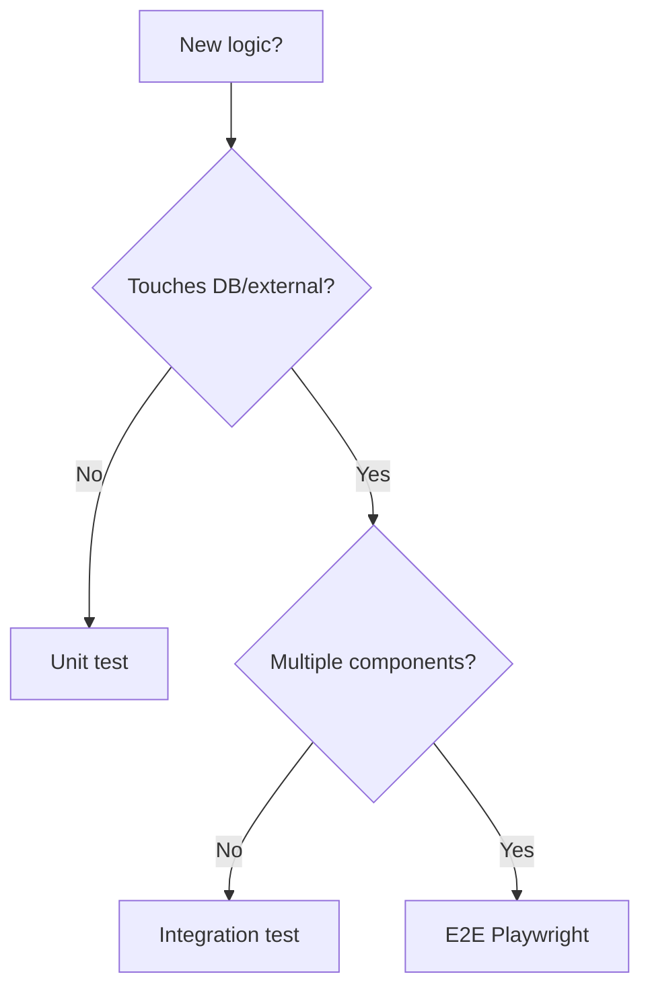
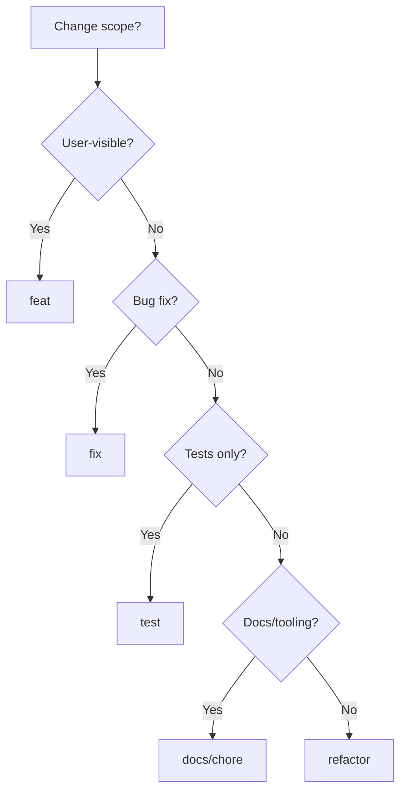
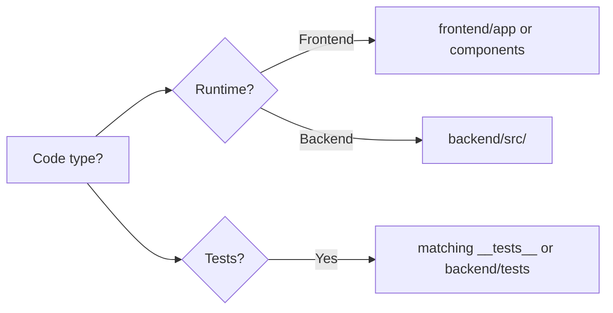
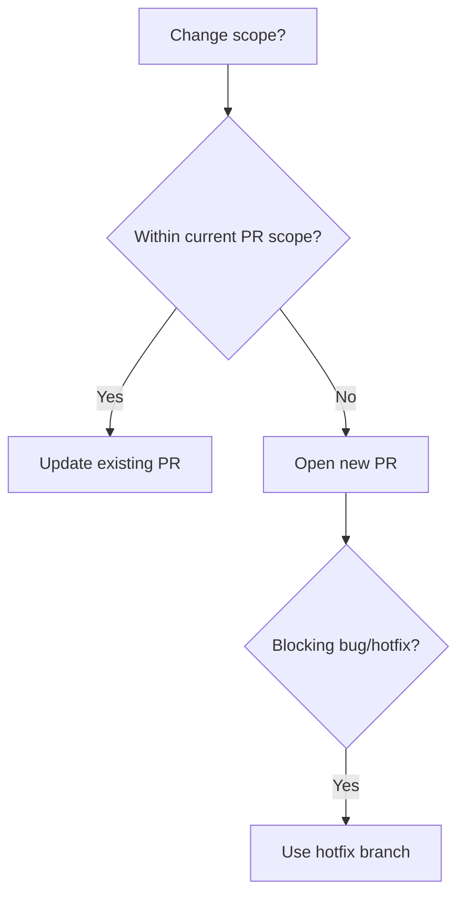
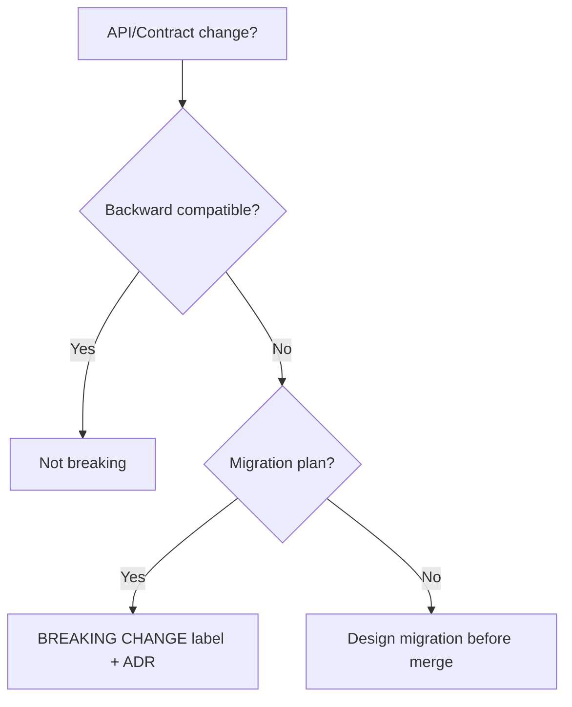
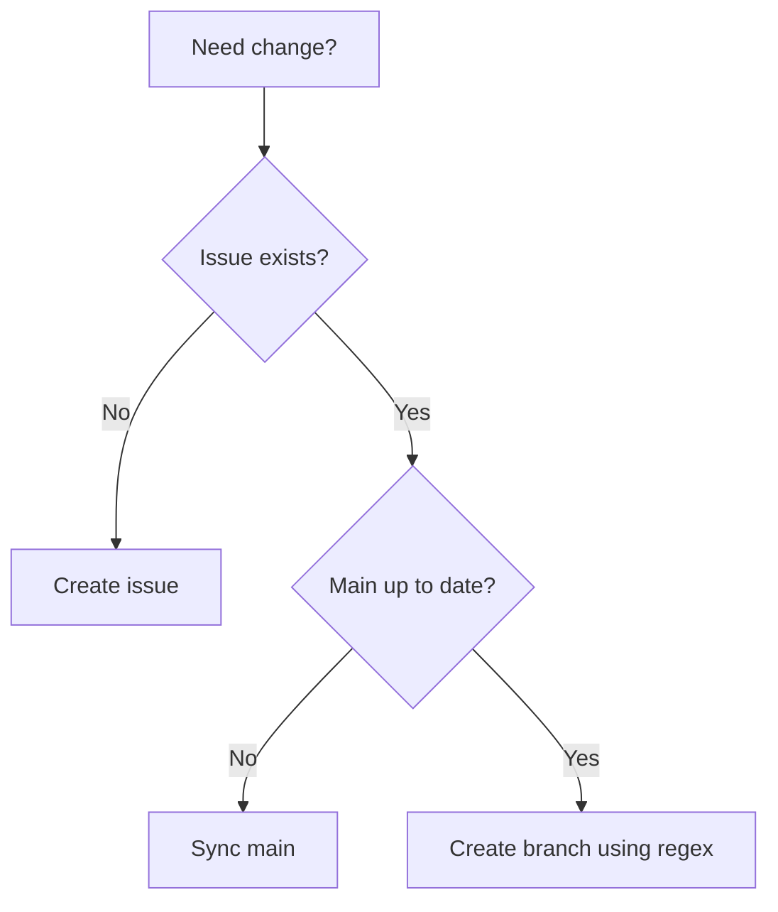

# DECISION_TREES.md

## Which Test Type?

```mermaid
flowchart TD
  A[New logic?] --> B{Touches DB/external?}
  B -- No --> C[Unit test]
  B -- Yes --> D{Multiple components?}
  D -- No --> E[Integration test]
  D -- Yes --> F[E2E Playwright]
```

## Which Commit Type?

```mermaid
flowchart TD
  A[Change scope?] --> B{User-visible?}
  B -- Yes --> C[feat]
  B -- No --> D{Bug fix?}
  D -- Yes --> E[fix]
  D -- No --> F{Tests only?}
  F -- Yes --> G[test]
  F -- No --> H{Docs/tooling?}
  H -- Yes --> I[docs/chore]
  H -- No --> J[refactor]
```

## File Location?

```mermaid
flowchart LR
  A[Code type?] --> B{Runtime?}
  B -- Frontend --> C[frontend/app or components]
  B -- Backend --> D[backend/src/<layer>]
  A --> E{Tests?}
  E -- Yes --> F[matching __tests__ or backend/tests]
```

## New PR vs Existing?

```mermaid
flowchart TD
  A[Change scope?] --> B{Within current PR scope?}
  B -- Yes --> C[Update existing PR]
  B -- No --> D[Open new PR]
  D --> E{Blocking bug/hotfix?}
  E -- Yes --> F[Use hotfix branch]
```

## Breaking Change?

```mermaid
flowchart TD
  A[API/Contract change?] --> B{Backward compatible?}
  B -- Yes --> C[Not breaking]
  B -- No --> D{Migration plan?}
  D -- Yes --> E[BREAKING CHANGE label + ADR]
  D -- No --> F[Design migration before merge]
```

## Create New Branch?

```mermaid
flowchart TD
  A[Need change?] --> B{Issue exists?}
  B -- No --> C[Create issue]
  B -- Yes --> D{Main up to date?}
  D -- No --> E[Sync main]
  D -- Yes --> F[Create branch using regex]
```

