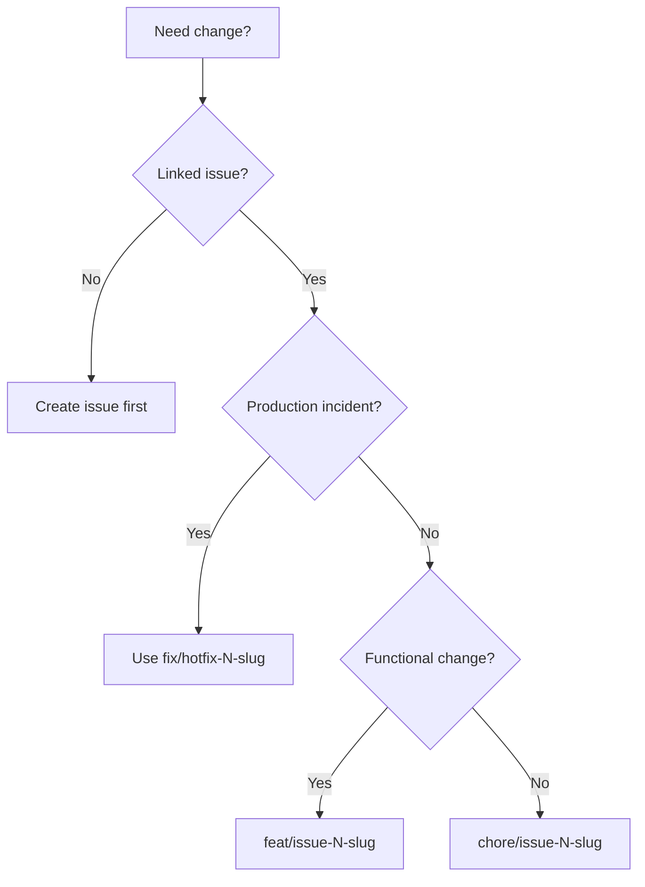

# IMPLEMENTATION_RULES.md
Version: 1.0.0 · Last Updated: 2025-02-09 · Owner: Architecture Guild  
Feedback: open issue with label `ruleset` and @mention @arch-guild.  
<details><summary>Change Log</summary>

| Date | Version | Summary | Owner |
| --- | --- | --- | --- |
| 2025-02-09 | 1.0.0 | Initial compressed rule set covering Git→Deployment | @arch-guild |

</details>

## Table of Contents
1. [Quick Start](#quick-start)
2. [Git Workflow Rules](#git-workflow-rules)
   - [Branch Naming](#branch-naming)
   - [Commit Conventions](#commit-conventions)
   - [Pull Request Process](#pull-request-process)
3. [Code Organization](#code-organization)
   - [Directory Structure](#directory-structure)
   - [File Naming](#file-naming)
   - [Module Organization](#module-organization)
4. [Testing Standards](#testing-standards)
   - [Unit Tests](#unit-tests)
   - [Integration Tests](#integration-tests)
   - [E2E Tests](#e2e-tests)
   - [Coverage Requirements](#coverage-requirements)
5. [Code Quality](#code-quality)
   - [Linting Rules](#linting-rules)
   - [Formatting Standards](#formatting-standards)
   - [Code Review Checklist](#code-review-checklist)
6. [Docker & Infrastructure](#docker--infrastructure)
   - [Dockerfile Best Practices](#dockerfile-best-practices)
   - [Docker Compose Guidelines](#docker-compose-guidelines)
   - [Environment Variables](#environment-variables)
7. [CI/CD Pipeline](#cicd-pipeline)
   - [Pipeline Stages](#pipeline-stages)
   - [Quality Gates](#quality-gates)
   - [Deployment Process](#deployment-process)
8. [Documentation](#documentation)
   - [Code Comments](#code-comments)
   - [API Documentation](#api-documentation)
   - [README Standards](#readme-standards)
   - [ADR Process](#adr-process)
9. [Security & Compliance](#security--compliance)
   - [Secret Management](#secret-management)
   - [Dependency Scanning](#dependency-scanning)
   - [Security Checklist](#security-checklist)
10. [Common Patterns](#common-patterns)
    - [Error Handling](#error-handling)
    - [Logging](#logging)
    - [API Responses](#api-responses)
11. [Anti-Patterns](#anti-patterns-what-not-to-do)
12. [Decision Trees](#decision-trees)
13. [Templates & Generators](#templates--generators)
14. [Metrics & Thresholds](#metrics--thresholds)
15. [Troubleshooting](#troubleshooting)
16. [Appendix: Tool Configurations](#appendix-tool-configurations)
17. [Changelog](#changelog)

---

## Quick Start
1. ✅ Always branch from `main`, name branches via regex `^(feat|fix|chore|docs|refactor|test)/(issue-\d+|hotfix-\d+|exp-[a-z0-9-]+)$`.
2. ✅ Every PR must pass lint → test → integration → docker → e2e → security before review.
3. ✅ Keep commits atomic: ≤150 lines, single concern, include tests & docs updates.

---

# Git Workflow Rules

## Branch Naming
| Scenario | Regex | Example | Notes |
| --- | --- | --- | --- |
| Feature | `feat/issue-\d+-[a-z0-9-]+` | `feat/issue-123-focus-chart` | Mandatory tests & docs |
| Bug fix | `fix/issue-\d+-[a-z0-9-]+` | `fix/issue-98-db-timezone` | Include regression test |
| Chore/tooling | `chore/issue-\d+-[a-z0-9-]+` | `chore/issue-77-ci-cache` | Non-functional |
| Hotfix | `fix/hotfix-\d+-[a-z0-9-]+` | `fix/hotfix-45-env-leak` | Requires retro ADR |
| Experimental spike | `feat/exp-[a-z0-9-]+` | `feat/exp-context-sim` | Must be short-lived |

<details><summary>Branching Decision Flow</summary>


</details>

### When to create vs reuse branch
- Create new branch when scope shifts, issue ID changes, or history is polluted.
- Reuse only if continuing same issue with <3 days stale and no force-push needed.

## Commit Conventions
<details><summary>Commit Message Template</summary>

```
<type>(<scope>): <subject>

<body - optional, wrap 72 chars>

<footer - optional (BREAKING CHANGE: ..., Closes #n)>
```
</details>

### Quick Selector
| If change is… | Type | Scope examples |
| --- | --- | --- |
| UI component, styling | `feat` | `frontend`, `focus-ui`, `timeline` |
| API route, service | `feat`/`fix` | `backend`, `session`, `auth` |
| Tests only | `test` | `backend`, `frontend`, `e2e` |
| Tooling, build, docs | `chore`, `docs` | `ci`, `docs`, `docker` |

Subject formula: `verb-object-detail` e.g., `feat(session): add pause endpoint`. Body when describing rationale/limitations. Footer for `BREAKING CHANGE` or issue closure.

### PR Title & Description
| Required | Format |
| --- | --- |
| Title | `[type] scope – summary (issue #)` e.g. `[feat] backend – focus resume endpoint (#123)` |
| Description | Template in PR generator; include checklist, screenshots, test results, rollout plan |

Merge strategy decision tree: squash merge default; rebase merge allowed only for linear history requirement; merge commit reserved for release branches.

---

# Code Organization

## Directory Structure
```
devflow/
├── backend/
│   ├── src/ (config, routes, services, models, dto, middleware, repositories, utils)
│   ├── migrations/
│   ├── tests/
│   ├── docs/
├── frontend/
│   ├── app/
│   ├── components/
│   ├── hooks/
│   ├── tests/
├── docs/
├── .github/
├── ops/
```

## File Naming
- Rust: snake_case modules, PascalCase structs/enums, tests `*_test.rs`.
- Next.js: components PascalCase, hooks camelCase with `use` prefix.
- Tests: `*.spec.tsx`, `*.test.ts`.
- Configs: `*.config.[mj]s`, `*.config.ts`.
- Docs: kebab-case `.md`.

## Module Organization
- Each router -> handler -> service -> repository chain lives in dedicated modules.
- Module size limit: 300 LOC; split earlier if complexity climbs.
- Import order: std → crates → workspace → local; blank line between groups.

---

# Testing Standards

## Unit Tests
- Location: same folder as source (Rust) or `__tests__` sibling (Next). Backend integration helpers in `backend/tests/common`.
- Naming: `<file>.test.rs`, `<Component>.spec.tsx`.
- Template (AAA):

```rust
#[cfg(test)]
mod tests {
    use super::*;

    #[test]
    fn it_returns_metric() {
        // Arrange
        let input = FocusSession::default();
        // Act
        let result = compute_metric(&input);
        // Assert
        assert_eq!(result.value, 42);
    }
}
```

## Integration Tests
- Backend: `backend/tests/integration/*.rs` using `tests/common::spawn_app`.
- Frontend: `tests/integration/` with MSW to simulate external APIs.
- Use docker-compose.test for DB/Redis/GitHub stubs.
- Ensure each test resets state (transaction rollback or cleanup).

## E2E Tests
- Playwright in `tests/e2e/`.
- Page Object Model stored under `tests/e2e/pages/`.
- Cover only critical journeys: start/pause/resume focus, context switch logging, auth/login, GitHub sync.

## Coverage Requirements
| Layer | Threshold | Tool |
| --- | --- | --- |
| Backend | 80% statements/lines, 75% branches | `cargo llvm-cov` |
| Frontend | 80% statements/lines/functions, 75% branches | Vitest coverage |
| E2E | Cover critical use-cases | Playwright |

### Mock vs Real Decision Tree
```mermaid
flowchart TD
  A[Test target?] --> B{External dependency?}
  B -- No --> C[Use real objects]
  B -- Yes --> D{Deterministic + fast?}
  D -- Yes --> E[Dockerized dependency]
  D -- No --> F[Mock/stub (MSW, trait impl)]
```

### What to Test vs Skip
- Test: business rules, error paths, DTO validation, auth flows, data transformations, context metrics.
- Skip: getters/setters, library internals, generated files.

---

# Code Quality

## Linting Rules
- ESLint must never disable: `no-unused-vars`, `@typescript-eslint/naming-convention`, `react-hooks/rules-of-hooks`, `import/order`.
- Rust: `cargo fmt`, `cargo clippy -- -D warnings` run pre-commit.
- Exceptions require ADR + inline justification comment linking to issue.

## Formatting Standards
- Prettier: 2 spaces, single quotes, 80 char width, trailing commas.
- Rustfmt: default.
- CSS/Tailwind: follow design tokens defined in `app/globals.css`.

## Code Review Checklist
<details><summary>Reviewer Questions</summary>

- ✅ Does each commit map to one concern?
- ✅ Are tests covering new logic + regressions?
- ✅ Are secrets/configs untouched or documented?
- ✅ Do API/DTO changes update docs & clients?
- ✅ Are logs/errors structured and actionable?
- ✅ Performance/security implications addressed?

</details>

---

# Docker & Infrastructure

## Dockerfile Best Practices
- Multi-stage builds: base → chef → builder → runtime.
- Order: dependencies cache → copy source → build.
- Run as non-root user; set `USER 1000`.
- Use `.dockerignore` to exclude `node_modules`, `target`, `docs`, logs.
- Provide `HEALTHCHECK` hitting `/health`.
- Combine RUN commands to reduce layers.

## Docker Compose Guidelines
- Services: `app`, `frontend`, `database` (Postgres), `redis`, `test`, `nginx`.
- Use named volumes for Postgres (`pg_data`).
- Ports: backend 8000, frontend 3000, nginx 8080, db 5432, redis 6379.
- Env files per service; never hardcode secrets in compose file.
- `depends_on` ensures DB/redis before app.

## Environment Variables
- Pattern: `.env.example` -> local copies (`.env`, `.env.local`).
- Frontend public vars: `NEXT_PUBLIC_*`.
- Document every new env var in `docs/architecture/system-overview.md` + `.env.example`.
- Use docker secrets/CI secrets for production.

---

# CI/CD Pipeline

## Pipeline Stages
1. **Frontend**: install → lint → unit tests (Vitest) → coverage artifact.
2. **Backend**: fmt → clippy → unit/integration tests → coverage.
3. **Integration**: `docker compose -f docker-compose.test.yml up --build --abort-on-container-exit`.
4. **Docker**: build image → Trivy scan (fail on HIGH/CRITICAL).
5. **E2E**: Playwright against docker stack; upload traces.
6. **Deploy**: staging auto on `main`, production manual approval.

## Quality Gates
- All jobs green.
- Coverage thresholds met; failing coverage aborts pipeline.
- Lint warnings resolved.
- Trivy passes; failing scan blocks merge.
- PR must have ≤500 LOC ( >1000 requires lead sign-off ).

## Deployment Process
- Images tagged with commit SHA.
- Staging deploy automatically after e2e success.
- Production deploy requires manual approval + changelog entry.
- Rollback: redeploy previous SHA + run smoke tests; document in INCIDENT.md.

---

# Documentation

## Code Comments
- Use inline comments only for “why”.
- Document exported functions with JSDoc/TSDoc:

```ts
/**
 * Calculates context-switch penalty.
 * @param session FocusSession
 * @returns penalty score 0-1
 * @throws RangeError when duration < 0
 */
```

## API Documentation
- Maintain `docs/api/API.md` with request/response examples.
- Each endpoint entry: method, path, auth, payload schema, error codes.

## README Standards
- Structure: Title → Overview → Prereqs → Quick Start → Architecture → Dev Workflow → Testing → Deployment → Troubleshooting → Contributing.
- Keep overview ≤2 sentences.

## ADR Process
- File path: `docs/decisions/adr-XXXX-title.md`.
- Template: Context, Decision, Consequences, Status.
- Required for architecture, infra, or workflow changes.

---

# Security & Compliance

## Secret Management
- No `.env` committed; `.env.example` only.
- Rotate JWT secret quarterly.
- Use GitHub Actions secrets and environment protection rules.
- Document secret owners in `docs/Security/SECURITY.md`.

## Dependency Scanning
- Enable Dependabot (already).
- `npm audit --production` and `cargo audit` run monthly.
- Trivy image scan in CI; fail on HIGH/CRITICAL.

## Security Checklist
| Area | Rule | Example |
| --- | --- | --- |
| Input validation | Validate DTOs (`validator` crate, Zod) | `RegisterRequest` with `#[validate(email)]` |
| Auth | All `/api/v1/**` (except `/health`) require JWT | Add middleware |
| Logging | Include `request_id`, `user_id`, `session_id` | `tracing::info!(user_id, ...)` |
| Audit | Store immutable auth events | `audit_logs` table |
| Rate limiting | Apply `tower::limit::ConcurrencyLimitLayer` | config-driven |

---

# Common Patterns

## Error Handling
```rust
#[derive(thiserror::Error, Debug)]
pub enum AppError {
    #[error("validation error: {0}")]
    Validation(String),
    #[error("not found: {entity}")]
    NotFound { entity: String },
    #[error(transparent)]
    Unexpected(#[from] anyhow::Error),
}

impl IntoResponse for AppError {
    fn into_response(self) -> Response {
        // map to JSON problem response with status codes
    }
}
```

## Logging
- Use `tracing` with JSON formatter.
- Fields: `request_id`, `user_id`, `session_id`, `latency_ms`.
- Levels: `trace` (dev), `debug` (feature), `info` (state changes), `warn` (recoverable), `error`.

## API Responses
```json
{
  "status": "success",
  "data": { },
  "meta": { "requestId": "uuid", "timestamp": "ISO8601" },
  "errors": []
}
```

## Database Query Patterns
- Use SQLx query macros with named parameters.
- Wrap operations in services; repositories return domain models, not JSON.
- Use transactions for multi-step writes.

## Configuration Management
- `config` module loads from `.env`, environment overrides, `config/*.toml`.
- Provide typed settings struct shared across app.

---

# Anti-Patterns (What NOT to do)
- ❌ Mixing unrelated fixes in one commit/PR.
- ❌ Skipping tests “because trivial”.
- ❌ Disabling lint rules without ADR.
- ❌ Pushing directly to `main`.
- ❌ Committing secrets or `.env`.
- ❌ Relying on manual deploys without CI.
- ❌ Leaving docs/tests outdated after change.

---

# Decision Trees
See `.github/DECISION_TREES.md` for detailed flowcharts; quick references:
- [Which test type?](#testing-standards)
- [Commit type?](#commit-conventions)
- [File location?](#code-organization)
- [Branch and PR decisions?](#git-workflow-rules)

---

# Templates & Generators

## Daily Checklist
| Start of Day | End of Day |
| --- | --- |
| Pull `main`, rebase branch | Push commits, ensure CI green |
| Review task board & blockers | Update PR status |
| Verify env vars & compose stack | Document blockers in issue |

## Commit Message Generator
<details><summary>Steps</summary>

1. Select type (`feat`, `fix`, `chore`, `docs`, `test`, `refactor`).
2. Select scope (`frontend`, `backend`, `ci`, etc.).
3. Subject = `verb object detail`.
4. Body: “Why”, “How”, “Tests run”.
5. Footer: `Closes #<issue>` and/or `BREAKING CHANGE: ...`.

</details>

## PR Description Template
```
## Summary
- 

## Testing
- [ ] npm run lint
- [ ] npx vitest run --coverage
- [ ] cargo test --all
- [ ] docker compose -f docker-compose.test.yml up --build --abort-on-container-exit
- [ ] npx playwright test

## Screenshots / Logs

## Deployment Notes
- Rollout:
- Rollback:

## Checklist
- [ ] Docs/ADR updated
- [ ] Secrets untouched
- [ ] Linked issue #
```

## File Header Templates
```ts
/**
 * @file Brief description
 * @module ModuleName
 * @requires dependency-list
 */
```
```ts
/**
 * @file Tests for ModuleName
 * @group unit|integration|e2e
 */
```
```ts
/**
 * @file Configuration for ToolName
 * @see https://docs-link
 */
```

---

# Metrics & Thresholds
| Metric | Target | Enforcement |
| --- | --- | --- |
| Code coverage | 80/75/80/80 | CI fail if lower |
| Commit size | 10–100 LOC ideal, 300 max | PR review |
| PR size | <500 LOC preferred, >1000 requires justification | PR template |
| Build time | <5 min | CI warning |
| Unit tests | <2 min | local gating |
| Integration tests | <10 min | compose job |
| Cyclomatic complexity | <10 per function | ESLint + clippy |
| File length | <300 LOC | lint warning |

---

# Troubleshooting
| Issue | Action |
| --- | --- |
| Bad commit | `git revert <sha>` or `git reset --soft HEAD~1` (never force push unless solo) |
| Broken CI | Inspect failing job logs, fix, rerun; notify `#devflow-ci` |
| Failed deploy | Rollback via previous image tag, run smoke tests, update incident log |
| Merge conflict | Rebase on `main`, resolve, rerun tests |
| Urgent help | Ping @platform-oncall, @frontend-lead, or @backend-lead |

---

# Appendix: Tool Configurations
- ESLint root config `.eslintrc.js`
- Prettier `.prettierrc`
- Husky hook `.husky/pre-commit`
- Commitlint `commitlint.config.js`
- Vitest `vitest.config.ts`
- Dockerfile, Dockerfile.dev, docker-compose* in repo root.

---

# Changelog
See top-of-file change log; bump version when rules change materially.

